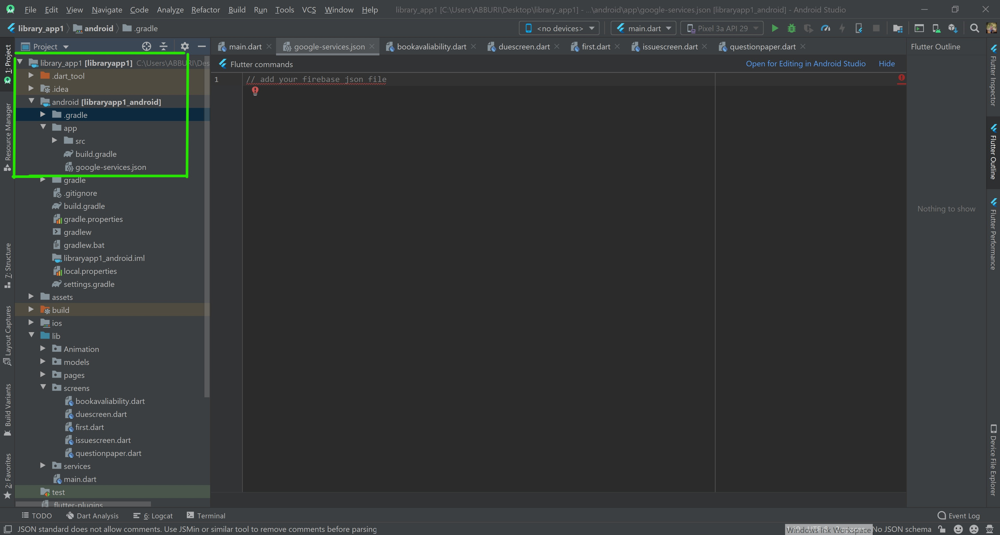
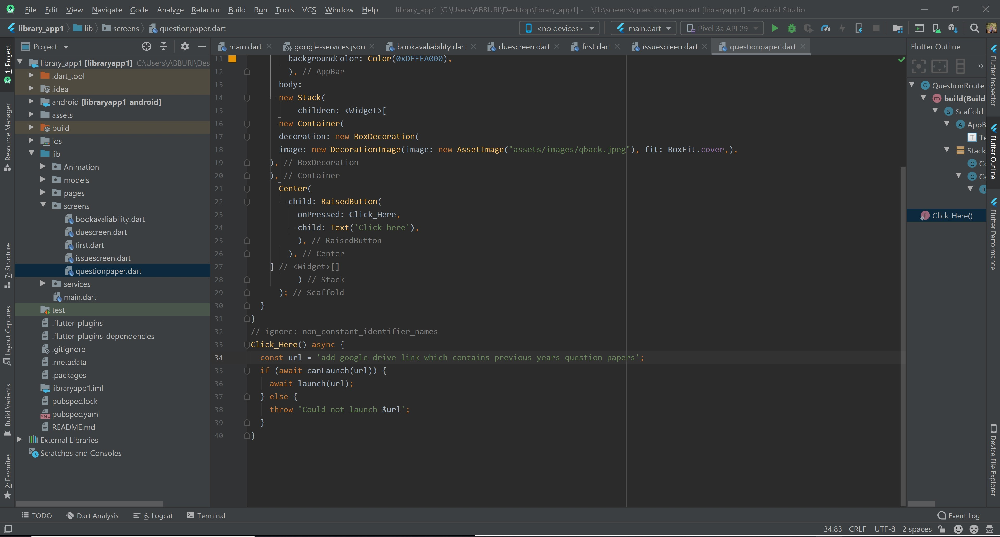
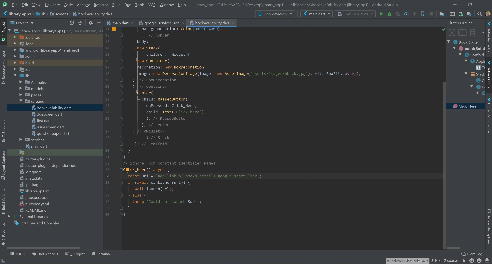
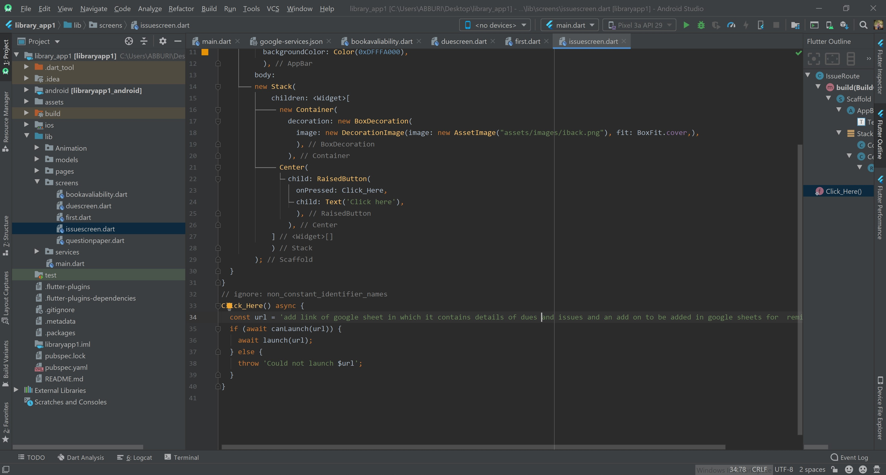

# simple-flutter-library-app
A simple flutter UI application for  college library.

After clonning the application one should have google firebase account.

Here is the link for google firebase
https://console.firebase.google.com/ and steps given there.

And json file to be added at this path as shown in image

Add google drive link which contains previous years question papers as shown this path,

Add google sheet link which contains details of books available in library,

Add google sheet link which contains details of books available in library,

